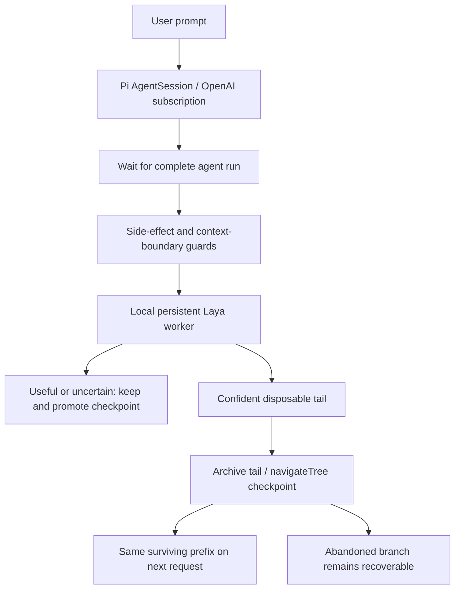

# Pi Context GC

Recoverable context archiving and session rewind experiments for [Pi](https://github.com/earendil-works/pi). This is a research prototype with local Laya and Von retention judges, benchmark fixtures, hidden evaluators, and recorded synthetic runs.

The general benchmark archives eligible tool outputs from earlier turns and replaces them with file references the coding agent can read again. Requirements and source reads stay protected. A fixed context budget drives removal; the classifier ranks candidates and its `KEEP_FULL` vote can be overridden. The interactive host uses a separate, conservative checkpoint/rewind policy and defaults to shadow mode.

## Latest results

Eight Python repair tasks, one repetition per arm, using `gpt-6-luna` through Pi's `openai-codex` provider. **The exploratory aggressive policy used 44.6% fewer total input tokens in the Laya arm**, with the same whole-task pass count as baseline.

| Metric | Baseline | Laya-guided | Von-guided |
| --- | ---: | ---: | ---: |
| Total input tokens, including cached input | 529,263 | 293,319 | 301,038 |
| Total input reduction | — | 44.6% | 43.1% |
| Whole tasks passed | 7/8 | 7/8 | 6/8 |
| Hidden checks passed | 138/147 | 146/147 | 145/147 |
| Uncached input change | — | +6.4% | +3.1% |

These are preliminary workload-specific measurements. Laya's paired bootstrap interval for total savings is **17.4–53.9%**. Equal task-pass counts do not establish equivalent production accuracy. Von failed the quality guard on a dotenv case. All three arms failed the record-sort task, with more failing cases in baseline.

Savings came from fewer cached input tokens; **uncached input increased**. We have not demonstrated lower bills, subscription quota use, or end-to-end latency. All eight Laya replacements overrode `KEEP_FULL`, so this does not establish an advantage from the learned judge over deterministic archiving.

The earlier safe-policy run showed **7.6% pooled savings for Laya and 20.3% for Von**, and about 33% for both on long tasks. V3 was explored after earlier results; independent agent generations also vary in request count and tool use. The next experiment should add a deterministic control, repeated trials, and unseen tasks with a frozen policy.

- [Complete v3 report](results/general-v3-aggressive-r1/GENERAL_REPORT.md), [design](results/general-v3-aggressive-r1/design.json), and [resume provenance](results/general-v3-aggressive-r1/RESUME_NOTES.md)
- [Complete v2 report](results/general-v2-r1/GENERAL_REPORT.md) and [benchmark protocol](GENERAL_BENCHMARK.md)
- [Evidence index and release scope](results/README.md)
- [Original cache/retention experiments](REPORT.md) and [context availability analysis](CEILING.md)

The historical gate asks for savings inside a 25–35% band, so it marks Laya v3 `ABOVE_TARGET_BAND`; its bootstrap lower bound is also below 25%. Von fails the quality guard. Neither is a pass of the original pooled gate.

## Reproduce the reported analysis

The checked-in artifacts can be analyzed without a model login or GPU:

```bash
python3 benchmarks/general-analysis/analyze.py results/general-v3-aggressive-r1
python3 benchmarks/general-analysis/analyze.py results/general-v2-r1
```

Add `--check-gate` to get a nonzero exit status when the original target gate is not met. Analysis regenerates the report files. The repository contains synthetic benchmark session traces; local paths in those historical traces are provenance, not portable recovery paths.

To run new trials after installing dependencies and signing in:

```bash
npm run benchmark:general -- --out=results/my-v3-run --policy=aggressive --repeats=1
```

Use a fresh output directory for a changed model, policy, evaluator, or implementation. **Run only one benchmark process per output directory.** A quota watcher is also a runner; stop it before resuming manually. Completed result files are skipped, including failed trials, so archive failures outside the analyzed run directory before retrying. See the [analysis guide](benchmarks/general-analysis/README.md).

## Run

Install the dependencies below and authenticate Pi with `/login` → `openai-codex` before running. The recorded experiments used an RTX 3070 for local judging. The main coding model uses the remote OpenAI subscription backend.

```bash
npm start -- --task="Fix the invoice parser while preserving decimal precision."
```

This starts a terminal SDK host in **shadow mode**: it records proposed decisions without collecting context. The main agent has Pi's read, bash, edit and write tools and can change files in the working directory. Laya itself only classifies local text.

```bash
# Enable conservative automatic tail collection explicitly.
npm start -- --task="Your concise task" --auto

# Reopen a saved Pi session, including its active branch/checkpoint.
npm start -- --task="Your concise task" --session=/absolute/path/to/session.jsonl
```

Commands: `/checkpoint` promotes the current state; `/restore ENTRY_ID` restores an archived assistant/metadata leaf; `/task TEXT` records a task change with the main agent and promotes it; `/exit` closes the host. Session paths and decision leaf IDs are printed. Traces and archives live in `.runtime/interactive/`.

Authentication uses Pi's existing `openai-codex` OAuth login if available. Otherwise it reads the current unexpired Codex login from `$CODEX_HOME/auth.json` or `~/.codex/auth.json` into memory. It does not copy credentials into this repository, change the Codex login, or fall back to an API key. An expired Codex token requires refreshing that login or using Pi's `/login` command. The default main model is `gpt-6-luna`; set `OPENAI_MODEL` to another model available through your subscription.

## Reproduce the experiments

```bash
npm run check
npm test
npm run experiment -- all

# Individual suites, with explicit output directories:
npm run experiment -- cache --out=results/my-cache-run
npm run experiment -- judge --out=results/my-judge-run
npm run experiment -- integration --out=results/my-integration-run
npm run experiment -- tools --out=results/my-tools-run
```

`cache` sends eleven requests including a 17k-token reference prefix, five tangent turns, three rewind continuations and a changed-system control. `judge` runs 26 local labeled diagnostics. `integration` compares two six-turn sessions for fact retention and token usage. `tools` reads a generated test log with and without the optional Laya filter. An `all` run sends 25 top-level prompts, with tool calls adding model requests, plus local inference, and consumes subscription quota.

For a fresh Linux installation:

```bash
npm ci
python3 -m venv .venv
.venv/bin/pip install -r requirements.lock.txt
# Needed by this CUDA/PyTorch build if Python.h is absent:
sudo apt-get install python3.12-dev
```

The lock records the tested Python 3.12, CUDA 13.0 environment. For another platform, install `requirements.txt` with the appropriate PyTorch build instead. `LAYA_DEVICE=cpu` selects CPU inference. The first run downloads model weights. `LAYA_PYTHON`, `LAYA_MODEL`, and `LAYA_REVISION` override the worker interpreter and checkpoint. The default checkpoint revision is pinned; other model IDs default to `main` unless a revision is specified.

## Architecture



`src/gc.ts` manages the durable checkpoint, tail decisions, archives and recovery. `src/runtime.ts` owns the subscription connection and request/usage instrumentation. `python/judge.py` loads Laya once, asks typed questions and returns probabilities. `src/post-tool-gc.ts` scores read-only tool results when they arrive, then rechecks the complete tail after `session.prompt()` finishes. Navigation happens at this settled boundary, never inside a live tool-call/result pair. `src/experiments.ts` and `src/coding-benchmark.ts` record real executions.

The current Pi extension API only exposes `navigateTree()` on command contexts. Ordinary event handlers do not receive it. This implementation uses the public SDK session method instead of trying to invoke a slash command from a post-tool hook.

The tail policy requires `DISCARD`, a discard score of at least 0.95, and a durable-information score of at most 0.05. It keeps uncertain, failed, oversized and partially understood inputs. Non-read-only tool calls, tool errors, image inputs, custom messages, compaction and context edits protect the whole tail. Unknown tools are protected; shell commands are protected even when they fail because partial side effects may remain. Collection never rolls back files.

All windows repeat the concise task. A tail is collectable only if every scored window passes the policy; useful evidence in a later window can veto collection. Task definitions over 100 Laya tokens or tails over 12,000 tokens are retained rather than silently truncated. Aggregated window scores are **not** calibrated probabilities for a whole conversation.

`KEEP_FULL`, `KEEP_RESULT` and `EXTERNALIZE` all preserve the tail at the checkpoint layer. An optional pre-context tool filter uses `KEEP_RESULT`/`EXTERNALIZE` to archive large results and provide a deterministic excerpt with a file reference. Laya never generates summaries. This filter is disabled unless tool names are explicitly listed in `GC_FILTER_TOOLS`, for example for a known log-producing tool. A `DISCARD` classification does not erase tool results before the main agent has seen them. Source reads and shell output are not filtered by default.

The eight regression tests exercise real Pi tree navigation/reopening, prefix preservation, recovery, promotion, shadow mode, inference failure, branch races, side-effect guards, exact artifact recovery, post-tool deferral and filter-event accounting. Tests use deterministic judge doubles to validate mechanics; the separately labeled experiment files contain actual Laya and OpenAI responses.

## Scope of the result

This is a working research prototype, with a conservative default. Cache warming and automatic compaction are disabled in the host so experiments remain attributable. Delayed cache expiration, production coding-task success and retention-model fine-tuning have not been evaluated. The longer synthetic benchmark exercises repeated cacheable prefixes but does not replicate production sessions with millions of cached tokens. Exact cache hits and quota savings should be measured again when changing models, tools or system prompts.

## License and upstream projects

Original code and documentation are released under the [MIT license](LICENSE). Third-party dependencies and model weights retain their own licenses; no model weights are bundled. See [third-party notes](THIRD_PARTY.md).
